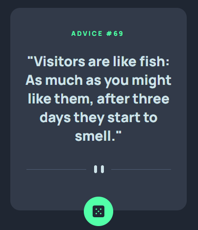
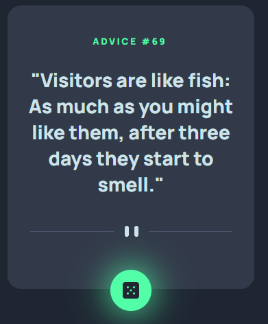
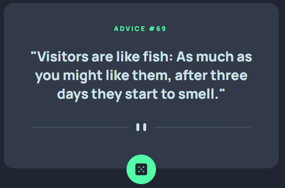

# Advice generator app solution

This is a solution to the [Advice generator app challenge on Frontend Mentor](https://www.frontendmentor.io/challenges/advice-generator-app-QdUG-13db). Frontend Mentor challenges help you improve your coding skills by building realistic projects.

## Table of contents

-   [Overview](#overview)
    -   [The challenge](#the-challenge)
    -   [Screenshot](#screenshot)
-   [My process](#my-process)
    -   [Built with](#built-with)
    -   [What I learned](#what-i-learned)
    -   [Continued development](#continued-development)
    -   [Useful resources](#useful-resources)

**Note: Delete this note and update the table of contents based on what sections you keep.**

## Overview

### The challenge

Users should be able to:

-   View the optimal layout for the app depending on their device's screen size
-   See hover states for all interactive elements on the page
-   Generate a new piece of advice by clicking the dice icon

### Screenshot



-   Mobile



-   When Hover



-   Desktop

## My process

### Built with

-   CSS custom properties
-   desktop-first workflow
-   vanilla js and fetch() web api

### What I learned

```js
async function getapi(url) {
    const response = await fetch(url);

    var data = await response.json();
    if (response) {
        hideloader();
    }
    show(data);
}
```

-   I learned how to get response with using fetch() api

```css
@keyframes load {
    0% {
        transform: rotate(0);
    }
    100% {
        transform: rotate(360deg);
    }
}

#loading {
    width: 50px;
    height: 50px;
    margin: 0 auto;
    border: 5px solid var(--Grayish-Blue);
    border-radius: 50%;
    border-top-color: var(--Neon-Green);
    animation: load 1s linear infinite;
}
```

-   I made a loader with css

If you want more help with writing markdown, we'd recommend checking out [The Markdown Guide](https://www.markdownguide.org/) to learn more.

### Continued development

I want to make this project with react and I will compare js version and react version. I'll learn which one is more suitable for this project

### Useful resources

-   [how to use fetch api](https://www.geeksforgeeks.org/how-to-use-the-javascript-fetch-api-to-get-data/)
-   [adviceslip json-api](https://api.adviceslip.com/)
